# Scholub Database ERD

## 엔티티 관계 다이어그램

```mermaid
erDiagram
    User ||--o| UserPreference : has
    User ||--o{ Bookmark : creates
    User ||--o{ Comment : writes
    User ||--o{ Reaction : makes
    User ||--o{ PaperView : tracks
    User ||--o{ Notification : receives
    User ||--o{ Subscription : subscribes
    User ||--o{ ChatSession : owns
    User ||--o{ Scheduler : manages
    User ||--o{ UserActivity : performs
    User ||--o| Asset : "has avatar"
    
    Paper ||--o{ Bookmark : "bookmarked by"
    Paper ||--o{ Comment : "has comments"
    Paper ||--o{ Reaction : "receives reactions"
    Paper ||--o{ PaperView : "viewed by"
    Paper ||--o{ Discussion : "has discussions"
    Paper ||--o{ PaperRelation : "source paper"
    Paper ||--o{ PaperRelation : "related paper"
    Paper ||--o{ Asset : "has assets"
    Paper ||--o| Asset : "has thumbnail"
    
    ChatSession ||--o{ ChatMessage : contains
    Discussion ||--o{ DiscussionMessage : contains
    Comment ||--o{ Comment : "has replies"
    DiscussionMessage ||--o{ DiscussionMessage : "has replies"
    
    User {
        string id PK
        string email UK
        string password
        string name
        string bio
        string avatarId FK
        enum status
        datetime createdAt
        datetime updatedAt
    }
    
    Paper {
        string id PK
        string title
        string abstract
        string introduction
        string[] categories
        string[] tags
        string[] authors
        int year
        string journal
        string doi UK
        string aiSummary
        int likeCount
        int unlikeCount
        int shareCount
        int totalViewCount
        int commentCount
        string thumbnailId FK
        datetime createdAt
        datetime updatedAt
    }
    
    UserPreference {
        string id PK
        string userId FK
        string[] interestedCategories
        string[] interestedTags
        string[] interestedJournals
        string[] excludedCategories
        int minYear
        boolean enableNotifications
        boolean enableRecommendations
        datetime createdAt
        datetime updatedAt
    }
    
    Bookmark {
        string id PK
        string userId FK
        string paperId FK
        string note
        string folder
        datetime createdAt
        datetime updatedAt
    }
    
    Comment {
        string id PK
        string userId FK
        string paperId FK
        string content
        string parentId FK
        int likeCount
        boolean isEdited
        datetime createdAt
        datetime updatedAt
    }
    
    Reaction {
        string id PK
        string userId FK
        string paperId FK
        enum type
        datetime createdAt
    }
    
    PaperView {
        string id PK
        string userId FK
        string paperId FK
        int durationSeconds
        string ipAddress
        string userAgent
        datetime createdAt
    }
    
    Notification {
        string id PK
        string userId FK
        enum type
        string title
        string message
        string relatedPaperId
        boolean isRead
        datetime readAt
        enum priority
        datetime createdAt
    }
    
    Subscription {
        string id PK
        string userId FK
        enum type
        string target
        boolean isActive
        datetime createdAt
        datetime updatedAt
    }
    
    ChatSession {
        string id PK
        string userId FK
        string name
        string paperId
        datetime lastMessageAt
        datetime createdAt
        datetime updatedAt
    }
    
    ChatMessage {
        string id PK
        string chatSessionId FK
        string content
        enum role
        string[] referencedPaperIds
        datetime createdAt
    }
    
    Discussion {
        string id PK
        string paperId FK
        string title
        string content
        string creatorId
        int participantCount
        int messageCount
        datetime createdAt
        datetime updatedAt
    }
    
    DiscussionMessage {
        string id PK
        string discussionId FK
        string userId
        string content
        string parentId FK
        int likeCount
        boolean isEdited
        datetime createdAt
        datetime updatedAt
    }
    
    UserActivity {
        string id PK
        string userId FK
        string paperId
        enum type
        json metadata
        int score
        datetime createdAt
    }
    
    PaperRelation {
        string id PK
        string sourcePaperId FK
        string relatedPaperId FK
        enum type
        float similarityScore
        string description
        json metadata
        datetime createdAt
        datetime updatedAt
    }
    
    Asset {
        string id PK
        string filename
        string originalFilename
        string contentType
        bigint fileSize
        string key UK
        string paperId FK
        datetime createdAt
    }
    
    Scheduler {
        string id PK
        string userId FK
        string name
        string description
        string cronExpression
        datetime lastRun
        datetime nextRun
        enum status
        datetime createdAt
    }
```

## 주요 관계 설명

### 1:1 관계
- **User ↔ UserPreference**: 사용자는 하나의 설정을 가짐
- **User ↔ Asset (Avatar)**: 사용자는 하나의 아바타를 가짐
- **Paper ↔ Asset (Thumbnail)**: 논문은 하나의 썸네일을 가짐

### 1:N 관계
- **User → Bookmark**: 사용자는 여러 북마크를 가짐
- **User → Comment**: 사용자는 여러 댓글을 작성함
- **User → Reaction**: 사용자는 여러 반응을 남김
- **User → Notification**: 사용자는 여러 알림을 받음
- **User → ChatSession**: 사용자는 여러 채팅 세션을 가짐
- **Paper → Comment**: 논문은 여러 댓글을 가짐
- **Paper → Asset**: 논문은 여러 첨부파일을 가짐
- **ChatSession → ChatMessage**: 채팅 세션은 여러 메시지를 포함함
- **Discussion → DiscussionMessage**: 토론은 여러 메시지를 포함함

### M:N 관계 (중간 테이블로 구현)
- **User ↔ Paper (via Bookmark)**: 사용자와 논문은 북마크를 통해 연결
- **User ↔ Paper (via Reaction)**: 사용자와 논문은 반응을 통해 연결
- **User ↔ Paper (via PaperView)**: 사용자와 논문은 조회 기록으로 연결

### 자기 참조 관계
- **Comment → Comment**: 댓글은 대댓글을 가질 수 있음
- **DiscussionMessage → DiscussionMessage**: 토론 메시지는 답글을 가질 수 있음
- **Paper ↔ Paper (via PaperRelation)**: 논문들은 서로 관계를 맺음

## 카디널리티 요약

| 관계 | 타입 | 설명 |
|------|------|------|
| User - UserPreference | 1:1 | 필수 아님 |
| User - Bookmark | 1:N | 사용자당 여러 북마크 |
| User - Comment | 1:N | 사용자당 여러 댓글 |
| User - Reaction | 1:N | 사용자당 여러 반응 |
| User - Notification | 1:N | 사용자당 여러 알림 |
| User - ChatSession | 1:N | 사용자당 여러 채팅 |
| Paper - Comment | 1:N | 논문당 여러 댓글 |
| Paper - Reaction | 1:N | 논문당 여러 반응 |
| Paper - Asset | 1:N | 논문당 여러 파일 |
| Paper - PaperRelation | N:N | 논문 간 관계 |
| ChatSession - ChatMessage | 1:N | 세션당 여러 메시지 |
| Discussion - DiscussionMessage | 1:N | 토론당 여러 메시지 |

## 인덱스 전략

### 복합 인덱스
- `Bookmark(userId, paperId)` - UNIQUE
- `Reaction(userId, paperId, type)` - UNIQUE
- `Subscription(userId, type, target)` - UNIQUE
- `PaperRelation(sourcePaperId, relatedPaperId, type)` - UNIQUE

### 단일 인덱스
- 모든 FK 컬럼
- 검색/정렬에 자주 사용되는 컬럼 (categories, tags, createdAt 등)
- 필터링에 사용되는 컬럼 (status, type, isRead 등)

## Cascade 삭제 규칙

### ON DELETE CASCADE
- User 삭제 → 관련된 모든 데이터 삭제
- Paper 삭제 → 관련된 모든 데이터 삭제
- ChatSession 삭제 → 모든 ChatMessage 삭제
- Discussion 삭제 → 모든 DiscussionMessage 삭제
- Comment 삭제 → 모든 대댓글 삭제

### 데이터 보존
- Asset은 참조가 삭제되어도 보존 (별도 정리 작업 필요)
- Log는 영구 보존

## 데이터 무결성

### UNIQUE 제약
- User.email
- Paper.doi
- Asset.key
- Bookmark(userId, paperId)
- Reaction(userId, paperId, type)

### CHECK 제약 (애플리케이션 레벨)
- year > 1900 && year <= 현재년도
- similarityScore >= 0 && similarityScore <= 1
- durationSeconds >= 0
- score >= 0

### NOT NULL 제약
- 모든 PK, FK
- 핵심 비즈니스 데이터 (title, content, email 등)

